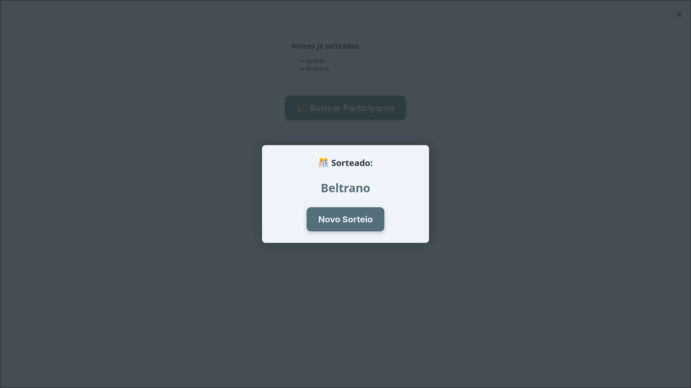

# 🥳 Sorteador de Nomes

Um sorteador de nomes simples, feito em JavaScript, que lê uma planilha `.xlsx` com nomes e sorteia aleatoriamente um vencedor. Ideal para eventos, brindes ou atividades em grupo!

## ✨ Funcionalidades

- Importação de planilha `.xlsx`;
- Sorteio aleatório de nomes com prevenção de repetição;
- Exibição do nome sorteado em um modal;
- Histórico de nomes sorteados;
- Interface limpa, com destaque para o botão de sorteio.

## 📦 Tecnologias utilizadas

- HTML, CSS e JavaScript puro
- [SheetJS (xlsx)](https://github.com/SheetJS/sheetjs) para leitura de arquivos `.xlsx`

## 💡 Como usar

1. Clone este repositório:
   ```bash
   git clone https://github.com/seu-usuario/nome-do-repo.git
   ```
2. Abra o arquivo `index.html` no seu navegador.
3. Importe um arquivo `.xlsx` com uma coluna chamada `Nome` ou `Nome Completo`.
4. Clique no botão **Sortear**.
5. Veja o nome sorteado no modal e acompanhe o histórico logo abaixo.

## 🧾 Exemplo de planilha esperada

| Nome            | Presença |
|------------------|----------|
| Fulano da Silva  | TRUE     |
| Beltrano Souza   | TRUE     |

> Apenas os nomes com `Presença = TRUE` serão considerados.

## 🖼️ Interface




## 📌 Melhorias futuras

- Suporte a mais de uma aba na planilha;
- Botão para "resetar" o sorteio;
- Exportação do histórico em `.txt` ou `.csv`.
